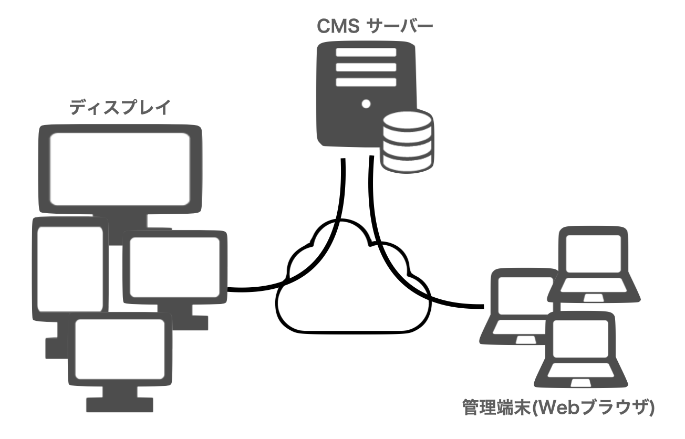

<!--toc=basic-->

# システムの構成を理解しよう

## システム構成

[[PRODUCTNAME]] Disital Signage Systemの全体像を以下に示します。

[[PRODUCTNAME]] Disital Signage System はその構成要素が全てクラウドに接続され。非常に柔軟で、スケーラブルな構成となっています。

- **CMSサーバー** システムの全体を制御します。配信する全てのデータおよびスケジュールはこのサーバーに格納されています。
- **管理端末** WebブラウザによりCMSサーバーに接続され、配信コンテンツの作成やスケジュール、表示端末の制御などを行います。Web経由ですので、どこからでも操作できます。
また、複数のメンバーにより操作が可能で、コンテンツの作成者、配信の管理者などの作業分担が可能です。
- **ディスプレイ** サイネージの画像を表示する端末で、ネットワークに接続され、CMSからの情報を表示します。

## システムの特徴

全てがWebネットワークに接続されており、世界中にどこからでもシアステムにアクセスでき、ディスプレイが数台の小規模サイネージから、数百台の大規模サイネージシステムの構築が可能です。

例えば全国に1000店舗を有する大型チェーンにおいても、全ての端末へのコンテンツ配信を可能にします。地域ごとに異なったコンテンツを配信することも容易に実現できます。

管理端末もWebブラウザーを利用しますので、世界中どこからでもアクセスでき、作業分担も可能です。

## 世界標準規格の採用

ディスプレイへのコンテンツ配信はHTMLという世界標準のコードで記述されており、Webクリエーターの方も学習が用意です。
また、CMSサーバーにおいてもオープンソース且つ世界標準の規格を採用しており、公開されたAPIなどにより他システムとの連携が容易に行えます。

例えば、Yahooニュースや天気予報、株価や為替情報を自動的に取得して、ディスプレイに表示することが簡単に実現できます。
また、企業内においても、カレンダーシステムと連動して予約情報を表示したり、他システムからデータを取得して情報表示するなど、応用範囲は無制限です。
