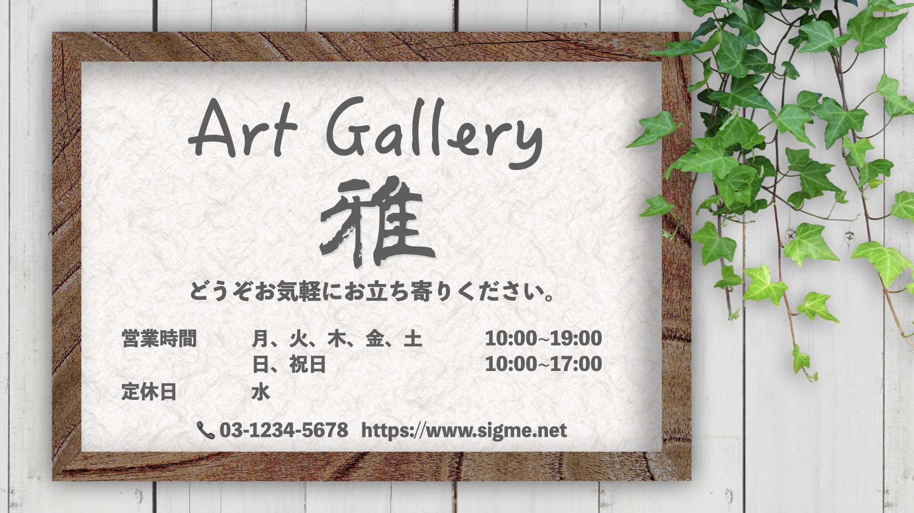
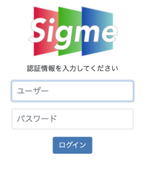

<!--toc=gallery-->

# デフォルトレイアウトを作ろう

『Art Gallery 雅』の看板となるレイアウトを作っていきます。

この画面は何か他の画面がスケジュールされていない時に表示される画面で、デフォルトレイアウトと言います。
表示するディスプレイ端末にこのデフォルトレイアウトを割り当てることで、イベント等の予定がない場合は、常にこのデフォルトレイアウト画面が表示されます。

## デフォルトレイアウトの画像を準備する

ここでは、最も簡単な画像１枚だけの画面を作っていきましょう。

### 画像を準備しましょう

画像は配信するディスプレイのサイズに合わせて作成しましょう。今回の例では、1920x1080のランドスケープディスプレイを対象としますので、このサイズで画像を用意します。画像作成はどんなソフトでも構いませんが、ファイル形式はpngとするのがお勧めです。

今回の例では以下の画面を用意しました。

### CMSにレイアウトを作ろう

[[PRODUCTNAME]] CMSに用意した画像を登録し、接続したディスプレイに画面を配信します。

- [[PRODUCTNAME]] CMSにアクセスし、**ユーザー名**と**パスワード**を入力しログインします。

- 

