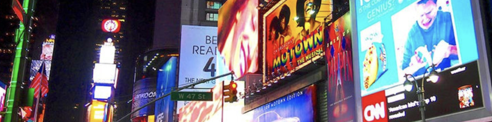

<!--toc=welcom-->

# はじめに

デジタルサイネージによるコンテンツの作成および配信は、より多くの視聴者にリーチできるため、企業にとって効果的なプロモーション戦略となっています。そのため、企業やホスピタリティ分野でのサイネージによるデジタルマーケティングの導入に拍車がかかると予想されています。4K技術を搭載したデジタルディスプレイは、より鮮明な画像を表示することができるため、高い需要があります。

COVID-19のパンデミックにより、数年にわたって、消費者とブランドは、最近のどの時点よりも迅速に変化に適応する必要がありました。企業のビジネスのやり方は変化しており、明確な終わりが見えないため、企業は創造性を発揮し、次の時代に備えて迅速に行動する必要があります。インタラクティブなデジタルサイネージは、ブランドが大衆とコミュニケーションする方法を変えました。ハードウェアとクラウドベースのCMSテクノロジーの進化は、新しいデジタルアプリケーションの開発に役立っています。これらのアプリケーションは、COVID-19パンデミックでビジネスを行うという課題を解決する上で企業を支援しています。

特にインターネットの普及により、作成したコンテンツを必要な場所と時間に即座に配信することが一般的となり、広告配信におけるコストの大幅な削減と、効果的なマーケティングが可能になりました。
クラウドからデジタルサイネージを配信することは、もはや常識となりつつあります。

コンテンツのクリエータは魅力的で効果的なWebページを作成する技術を磨いてきました。デジタルサイネージの世界でもWebページで養った技術をベースにアトラクティブな広告展開を可能にするプラットホームが求められています。

[[PRODUCTNAME]] コンテンツ マネージメント システム（以下CMSと呼ぶ）はWebでも利用されている世界標準のHTMLをベースとしているため、学習が容易で、クリエータの想像力を最大限に発揮できるプラットホームです。
また、少数のディスプレイ端末から、数百、数千に及ぶ巨大なサイネージネットワークを集中管理でき、多彩な配信機能や拡張性、他のアプリケーションとの融合機能を備えたプラットホームであり、多くの企業でその新価を発揮できます。

このクリエーターガイドでは、[[PRODUCTNAME]]の構成や操作を学ぶと同時に、具体的な事例をもとに、CMSでのコンテンツ作成と配信を学んでいきます。

このガイドが今後CMSのコンテンツ作成や運用を行う方々のお役に立てれば幸いです。

2022年10月 
SigmeProject  代表 三浦雅孝

